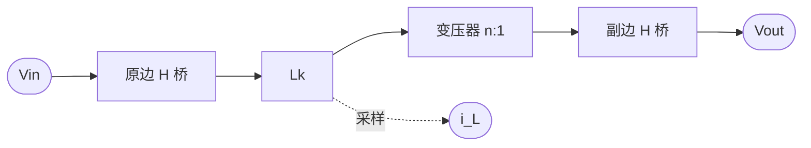
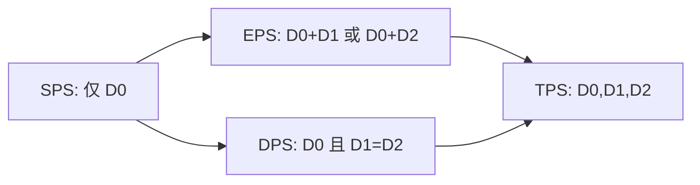
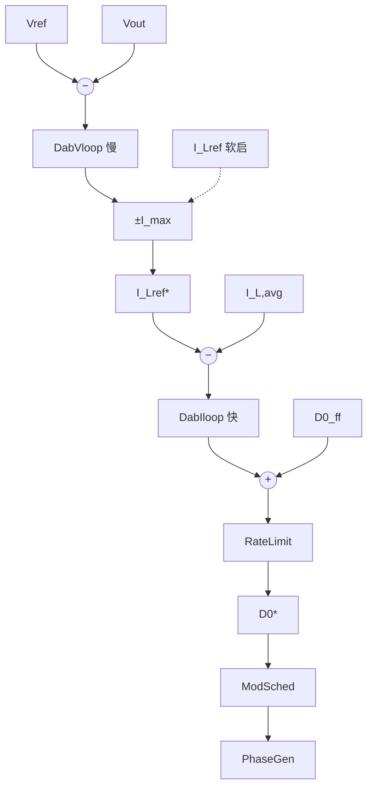
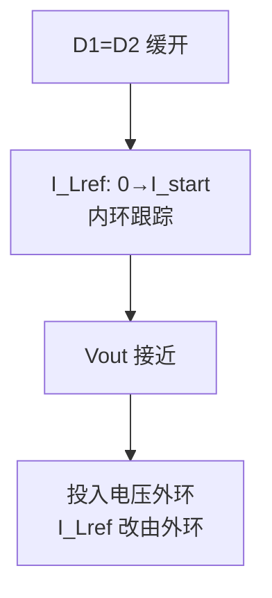
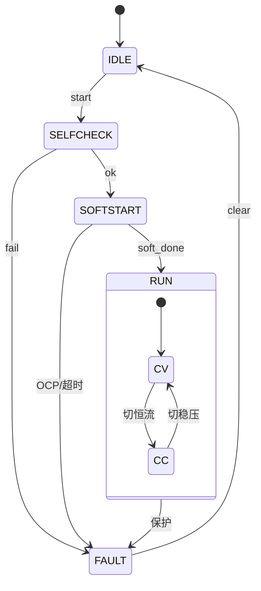

# DAB 双有源桥：难点、策略与算法框架（FPGA）

> 面向本仓 `Algorithm_Framework_HDL` 的选型与实现依据。  
> 写法对齐 [`INV3PH_ALGO_COMPARE.md`](INV3PH_ALGO_COMPARE.md)：先讲清难点，再给可落地方案。  
> 拟 RTL 路径：`rtl/verilog/cntl/dab/` · 修订：2026-09-20  
> 主控定案：**电压外环 + 漏感电流 \(i_L\) 平均内环**（级联）+ SPS  
> 姊妹文档：[LLC](LLC_CTRL_FRAMEWORK.md)

---

## 目录

1. [算法与拓扑原理](#1-算法与拓扑原理)
2. [SPS 固有局限——回流、应力与 ZVS](#2-sps-固有局限回流应力与-zvs)
3. [多移相调制——EPS/DPS/TPS 方案](#3-多移相调制epsdps-tps-方案)
4. [为何双闭环且内环用 \(i_L\)](#4-为何双闭环且内环用-i_l)
5. [平均电流获取——难点与方案](#5-平均电流获取难点与方案)
6. [变压器直流偏磁——难点与方案](#6-变压器直流偏磁难点与方案)
7. [软启动——难点与方案](#7-软启动难点与方案)
8. [轻载、双向与模式切换](#8-轻载双向与模式切换)
9. [保护策略](#9-保护策略)
10. [控制结构综合对比](#10-控制结构综合对比)
11. [FPGA 控制架构与模块划分](#11-fpga-控制架构与模块划分)
12. [实现复杂度与调试要点](#12-实现复杂度与调试要点)
13. [典型应用与选型建议](#13-典型应用与选型建议)
14. [附录：参数与接口草案](#14-附录参数与接口草案)

---

## 1. 算法与拓扑原理

### 1.1 功率级

两侧全桥经高频变压器与串联电感 \(L_k\)（漏感或外串）耦合，靠桥间移相传递功率，可双向。



| 符号 | 定义 |
|------|------|
| \(V_1,V_2\) | 原/副边直流母线 |
| \(n\) | 变比 |
| \(L_k\) | 传输电感 |
| \(f_s\) | 开关频率（一期定频） |
| \(D_0=\phi/\pi\) | 外移相标幺，\(\|D_0\|\le 0.5\) |
| \(D_1,D_2\) | 原/副边内移相 |
| \(k=nV_2/V_1\) | 电压匹配比 |
| \(i_L(t)\) | 漏感瞬时电流 |
| \(I_{L,avg}\) | 周期平均（内环反馈） |

**SPS 功率（单移相）：**

$$
P=\frac{n\,V_1\,V_2}{2\,f_s\,L_k}\,D_0\,(1-D_0)
\quad(0\le D_0\le 0.5)
$$

\(D_0=0.5\) 时 \(\|P\|\) 最大；\(D_0\)（及 \(I_{L,ref}\)）变号即功率反向。

### 1.2 控制在做什么

DAB 控制目标：**在安全电流与 ZVS 约束下，使传输功率（或 \(V_{out}\)/电流）跟踪指令。**  
本库一期把问题拆成：

1. **外环**给出安全的 \(I_{L,ref}\)；  
2. **内环**让 \(I_{L,avg}\to I_{L,ref}\)，输出 \(D_0\)；  
3. **调度层**在需要时打开 \(D_1/D_2\)（不取代内环）。

---

## 2. SPS 固有局限——回流、应力与 ZVS

### 2.1 难点描述

| 难点 | 现象 | 根因 |
|------|------|------|
| **回流功率（无功环流）** | RMS 电流大、导通损耗高 | \(V_1\) 与 \(nV_2\) 方波相位差导致能量来回抽运 |
| **电流应力大** | 峰值高，器件裕量吃紧 | SPS 仅一自由度，无法同时整形电流 |
| **轻载 ZVS 丢失** | 硬开关、EMI | 电感电流幅值不足以完成死区换流 |
| **电压比偏离** | \(\|k-1\|\) 大时回流急剧恶化 | 匹配变差时 SPS 最优工作点变窄 |

**直觉：** \(P\propto D_0(1-D_0)\) 只约束「平均功率」，不约束「电流波形形状」；形状要靠内移相再塑。

### 2.2 解决方案（分层）

| 层级 | 手段 | 作用 |
|------|------|------|
| 硬件 | \(n\) 贴近额定 \(V_1/V_2\)；合理 \(L_k\) | 缩小 \(\|k-1\|\) |
| **调制（§3）** | EPS/DPS/TPS | 降回流、扩 ZVS、降峰值 |
| **闭环（§4）** | \(i_L\) 内环限幅 | 直接限制平均/峰值应力 |
| 轻载 | 调度切 EPS/DPS；极轻载跳脉冲 | 保效率 |

**本库一期：** 闭环先跑通 **SPS + 双环**；轻载再启用 EPS/DPS 调度。

---

## 3. 多移相调制——EPS/DPS/TPS 方案

### 3.1 自由度定义



| 模式 | 自由度 | 典型收益 | 代价 |
|------|--------|----------|------|
| **SPS** | 1 | 实现最简 | 轻载/失配差 |
| **EPS** | 2 | 高压侧三电平，扩 ZVS、降回流 | 需侧别选择 |
| **DPS** | 2（对称） | 中载电流应力常优于 SPS | 两侧都要内移相 |
| **TPS** | 3 | 全范围最小电流应力 + 全软开潜力 | LUT/在线优化重 |

### 3.2 与闭环的关系（重要）

> **内环仍然只闭环到 \(D_0\)（或功率等价量）。**  
> \(D_1/D_2\) 由 `DabModSched` 根据 \(\|I_{L,ref}\|\)、\(k\) 查表/解析给出，属于 **前馈整形**，不是第二套慢 PI 抢执行器。

| \(\|I_{L,ref}\|\) / \(k\) | 建议模式 |
|---------------------------|----------|
| 中重载且 \(\|k-1\|\) 小 | SPS |
| 轻载或 \(\|k-1\|\) 大 | EPS 或 DPS |
| 全范围极致效率 | 二期 TPS-CO 类 LUT |

### 3.3 切换注意

- 模式切换时 \(D_0\) 连续，\(D_1/D_2\) **斜坡**进入，避免电流台阶。  
- 与电压比相关的表：输入 \(k\) 用滤波后的慢变量，防抖。

---

## 4. 为何双闭环且内环用 \(i_L\)

### 4.1 难点：单电压环不够

| 结构 | 做法 | 问题 |
|------|------|------|
| 单电压环 | \(V_{err}\to D_0\) | 过流靠外部削幅，暂态易冲过；双向切换软 |
| 电压→移相 + 电流限幅 | 稍好 | 限幅时电压环易饱和失控 |
| **电压→\(I_{L,ref}\)→电流→\(D_0\)** | 级联 | **限流在环内**；动态与保护清晰 |

文献与 BESS/双向充电工程普遍采用：**外环电压（或功率）生成电流参考，内环调移相跟踪电流。**

### 4.2 内环量选型

| 反馈量 | 适用 | 评价 |
|--------|------|------|
| **\(I_{L,avg}\)**（漏感周期平均） | **无额外输出滤波的 DAB（本拓扑）** | **一期选定** |
| 输出滤波电感电流 | 带 LC 的 DAB | 更贴电容电流 |
| 电池侧直流电流 | 充电 CC | 可作外环或内环，传感在直流侧 |
| \(i_{L,peak}\) | 峰值电流模式 | 保护快，数字斜坡补偿难 → 二期 |

### 4.3 定案结构



**外环**

$$
e_v=V_{ref}-V_{out},\quad
I_{L,ref}^{raw}=\mathrm{PI}_v(e_v),\quad
I_{L,ref}^{\*}=\mathrm{sat}(I_{L,ref}^{raw},[-I_{max},I_{max}])
$$

**内环**

$$
e_i=I_{L,ref}^{\*}-I_{L,avg},\quad
D_{0,pi}=\mathrm{PI}_i(e_i)
$$

$$
D_0^{\*}=\mathrm{RateLimit}\big(\mathrm{sat}(D_{0,ff}+D_{0,pi},[-D_{max},D_{max}])\big)
$$

**前馈（推荐）** — 减轻内环负担（`AlgoSqrt`/`AlgoDiv` 或 LUT）：

$$
D_{0,ff}=\mathrm{sign}(I_{L,ref}^{\*})\cdot
\frac{1-\sqrt{1-K\,|I_{L,ref}^{\*}|}}{2}
$$

其中 \(K=K(f_s,L_k,n,V_1,V_2)\)。

### 4.4 带宽

| 环 | 相对关系 | 作用 |
|----|----------|------|
| 内环 | \(\approx 5\sim10\times\) 外环，且 \(\ll f_s/10\) | 跟踪电流、限流 |
| 外环 | 低（视 \(C_{out}\)） | 稳压，输出即 \(I_{L,ref}\) |

外环积分在 \(I_{L,ref}\) 饱和时应抗饱和（`CompPi` 条件积分）。

---

## 5. 平均电流获取——难点与方案

### 5.1 难点描述

\(i_L(t)\) 为开关频交流（近分段线性）。若把瞬时采样直接送 PI：

- 环路被开关纹波抽打 → 抖动、噪声放大；  
- 与电压环同节拍时根本无法代表「传输电流」。

另需区分：

| 分量 | 含义 | 应否进功率内环 |
|------|------|----------------|
| \(I_{L,avg}\) | 与传输功率同号的周期平均 | **是** |
| \(I_{L,dc}\) | 伏秒不平衡造成的直流偏置 | **否**（另校正） |
| \(I_{L,peak}\) | 峰值 | 保护 |

### 5.2 解决方案

| 方案 | 做法 | 精度 | FPGA | 一期 |
|------|------|------|------|------|
| **周期累加平均** | 每 \(T_s\) 对 ADC 累加 / \(N_{sw}\) | 高 | 中 | **推荐** |
| `CompMovAvg` 窗=\(T_s\) | 复用库模块 | 高 | 易 | 可 |
| 相角同步少点采样 | 在已知相位取点解析平均 | 中高 | 省采样 | 可选 |
| 硬件低通 + 慢采 | 模拟预处理 | 中 | 易 | 需标定延迟 |

$$
I_{L,avg}[m]=\frac{1}{N_{sw}}\sum_{n=0}^{N_{sw}-1} i_L[m,n]
$$

**对齐：** 平均窗满脉冲与内环 `iEn` 对齐，避免用到半旧半新窗口。

**RTL：** `DabIlAvg` 输出 `I_L,avg` / `I_L,peak` / `I_L,dc`。

---

## 6. 变压器直流偏磁——难点与方案

### 6.1 难点描述

| 类型 | 诱因 | 后果 |
|------|------|------|
| **暂态偏磁** | \(D_0\) 阶跃更新、两侧驱动不对称 | 一两个周期内 \(i_L\) 整体抬升，饱和风险 |
| **稳态偏磁** | 管压降/死区/定时不匹配 | 持续直流，发热、易丢 ZVS |

这是 DAB 相对 LLC 更突出的难点之一。

### 6.2 解决方案

| 方案 | 针对 | 做法 | 一期 |
|------|------|------|------|
| **\(D_0\) 斜率限制** | 暂态 | `CompRateLimit` | **必做** |
| 软启先开 \(D_1=D_2\) | 稳态/启动 | 对称三电平缓入 | **必做** |
| \(I_{L,dc}\to 0\) 慢环 | 稳态 | 微调对称占空或双侧沿 | 二期 |
| DRES / 对称更新边沿 | 暂态 | 双边上升沿协同挪移 | 二期 |
| 零初值开关序列 | 启动/切换 | 从 \(i_L=0\) 构造序列 | 二期 |

**原则：** 任何快速改变传输功率的指令，先经斜率限制，再进 PhaseGen。

---

## 7. 软启动——难点与方案

### 7.1 难点描述

禁止「一步满移相」：输出电容相当于短路，\(D_0\) 突加 → \(i_L\) 浪涌 + 偏磁。

### 7.2 方案对比

| 方案 | 做法 | 电流可控性 | 偏磁 | 一期 |
|------|------|------------|------|------|
| \(D_0\) 开环斜坡 | 只爬移相 | 中 | 一般 | Fallback |
| **\(I_{L,ref}\) 斜坡 + 内环闭合** | 电流环从一开始工作 | **高** | 配合限斜率 | **主方案** |
| 变频启动 | \(f_s\) 与移相协同 | 高 | 复杂 | 二期 |
| 最优开关序列启动 | 轨迹规划 | 很高 | 优 | 二期 |

### 7.3 推荐流程



| 步骤 | 外环 | 内环 | 调制 |
|------|------|------|------|
| 1 | 旁路 | 闭合，跟软启 \(I_{L,ref}\) | \(D_1=D_2\) 缓开 |
| 2 | 旁路 | 同上 | \(D_0\) 由内环自然建立 |
| 3 | 投入 | 闭合 | SPS（或保持小内移相） |

超 \(I_{L,peak}\) → 冻结/回退 \(I_{L,ref}\) 斜坡。

---

## 8. 轻载、双向与模式切换

### 8.1 轻载

DAB **不优先照搬 LLC Burst**。推荐顺序：

1. 保持定频 + 内环；  
2. `ModSched` 切 EPS/DPS 降回流；  
3. 极轻载：脉冲跳跃 / 间歇移相；  
4. 待机：门极全关 + 预充监视。

### 8.2 双向

| 需求 | 做法 |
|------|------|
| 功率反向 | \(I_{L,ref}\)（及 \(D_0\)）变号；内环结构不变 |
| 穿越零功率 | \(I_{L,ref}\) 过零加死区或斜坡，避免频繁变号抖振 |
| CV↔CC | 只换外环参考源，内环不停 |

### 8.3 CC / CP

| 模式 | \(I_{L,ref}^{\*}\) |
|------|---------------------|
| CV | 电压环输出 |
| CC | 外部 \(I_{cmd}\) 斜坡 |
| CP | \(P^\*/V\) 或功率环 |

---

## 9. 保护策略

| 保护 | 检测 | 动作 |
|------|------|------|
| OCP | \(\|I_{L,peak}\|\) 优先，辅 \(\|I_{L,avg}\|\) | 削 \(I_{L,ref}\) → 关断锁存 |
| OVP | \(V_1\)/\(V_2\) | 锁存 |
| 偏磁 | \(\|I_{L,dc}\|\) 超限 | 校正失败则关断 |
| UVLO | 输入欠压 | 关断 |
| 通信/指令丢失 | 超时 | 受控卸功率到 0 |

保护优先级：**峰值电流 > 平均限幅 > 电压环**。

---

## 10. 控制结构综合对比

| 维度 | 单电压环→\(D_0\) | **V–\(i_L\) 双环（本库）** | 峰值电流内环 |
|------|------------------|---------------------------|--------------|
| 限流 | 弱 | **强（环内）** | 最强 |
| 双向切换 | 一般 | **好** | 好 |
| 实现难度 | 低 | 中 | 高 |
| 传感 | \(V_{out}\) | \(V_{out}+i_L\) | \(i_L\) 高速 |
| 偏磁敏感 | 高 | 中（加 RateLimit） | 中 |
| **一期** | 否 | **是** | 二期可选 |

| 维度 | SPS only | SPS+双环 | +EPS/DPS | +TPS LUT |
|------|----------|----------|----------|----------|
| 轻载效率 | ★★ | ★★★ | ★★★★★ | ★★★★★ |
| 实现量 | 小 | 中 | 中+ | 大 |
| **路线** | — | **D1–D2** | **D3** | D4 |

---

## 11. FPGA 控制架构与模块划分

### 11.1 系统状态机



### 11.2 模块表（拟 `cntl/dab/`）

| 模块 | 解决的难点 | 复用 |
|------|------------|------|
| `dab_cfg.vh` | 限幅、PI、窗长 | — |
| `DabIlAvg` | §5 平均/峰值/偏磁观测 | 累加或 `CompMovAvg` |
| `DabVloop` | §4 外环 | `CompPi` |
| `DabIloop` | §4 内环 | `CompPi` |
| `D0_ff` | 前馈 | `AlgoDiv`/`AlgoSqrt` |
| `DabSoftStart` | §7 | `CompSoftStart` |
| RateLimit | §6 暂态偏磁 | `CompRateLimit` |
| `DabModSched` | §2–§3 | — |
| `DabPhaseGen` | 移相时基 | — |
| `DabFault`/`DabState` | §9 / FSM | 对齐 inv3ph/pv |

### 11.3 控制拍顺序

1. `DabIlAvg` 更新（对齐 \(T_s\)）  
2. 故障 / 状态  
3. 软启或外环 → \(I_{L,ref}^{\*}\)  
4. 内环 + 前馈 + 斜率限制 → \(D_0^{\*}\)  
5. ModSched → PhaseGen  

---

## 12. 实现复杂度与调试要点

| 阶段 | 工作 | 风险 | 建议 |
|------|------|------|------|
| PhaseGen 开环 | 固定 \(D_0\) | 直通/极性 | 先看桥间相位 |
| **仅内环** | 阶跃 \(I_{L,ref}\) | 平均错、振荡 | 确认 `IlAvg` |
| 软启 | 爬 \(I_{L,ref}\) | 浪涌/偏磁 | 盯 \(I_{L,dc}\) |
| 双环 | 电压阶跃、加载 | 外环饱和 | 查 \(I_{max}\) 抗饱和 |
| 反向 | \(I_{L,ref}\) 变号 | 零点抖振 | 加过零斜坡 |
| EPS/DPS | 轻载对比 SPS | 切换浪涌 | \(D_1\) 斜坡 |

**资源直觉：** 双 `CompPi` + 平均器 + 移相计数，比三相多环逆变轻；TPS 大 LUT 才明显吃 BRAM。

---

## 13. 典型应用与选型建议

### 决策树

```
是否必须双向 / 电池侧？
├── 是 → V–i_L 双环（本库定案）
└── 否（单向稳压）
     └── 仍推荐双环（限流更好）；资源极紧才考虑单电压环

电压比是否长期偏离（|k−1| 大）或长期轻载？
├── 是 → D3 上 EPS/DPS 调度
└── 否 → SPS + 双环 足够

是否要全范围极致效率？
└── 是 → D4 TPS 优化 LUT
```

| 场景 | 推荐 |
|------|------|
| 储能 PCS 隔离 DCDC | 双环 + SPS，轻载 EPS/DPS |
| 车载充放电 | 双环 + 双向过零处理 + 软启 |
| 固比母线互联 | SPS + 双环即可 |
| 宽电压比高压互联 | TPS/EPS 优先纳入路线图 |

---

## 14. 附录：参数与接口草案

### A. 典型量级（须按功率等级缩放）

| 参数 | 量级 | 说明 |
|------|------|------|
| \(f_s\) | 20～100 kHz+ | 一期定频 |
| \(D_{max}\) | 0.45～0.5 | 留裕度 |
| 内环带宽 | 外环 5～10 倍 | 且 \(\ll f_s/10\) |
| 外环带宽 | 视 \(C_{out}\) | 常低于 1 kHz 量级 |
| \(I_{max}\) | 器件/磁件限制 | 外环输出饱和 |
| \(D_0\) 斜率 | 按偏磁实验定 | RateLimit |

### B. 验证清单

1. `IlAvg` 对已知三角波平均正确  
2. **仅内环**跟踪 \(I_{L,ref}\)  
3. 双环稳压 + 负载阶跃 + 抗饱和  
4. 软启不过流、无明显持续偏磁  
5. \(I_{L,ref}\) 变号功率反向  
6. OCP 锁存  
7. （D3）轻载 EPS/DPS 相对 SPS 的 \(I_{peak}\)/效率  

### C. 实现路线

| 阶段 | 内容 | 出口 |
|------|------|------|
| D1 | IlAvg + Iloop + PhaseGen | 内环 PASS |
| D2 | Vloop + SoftStart + Fault/State | 双环稳压 PASS |
| D3 | \(D_{0,ff}\) + EPS/DPS | 轻载/失配改善 |
| D4 | TPS / 偏磁慢环 / 峰值内环 | 按项目 |

---

*本文档供 FPGA 算法库实现选型；磁件、变比与采样链路决定具体数值标定。*
