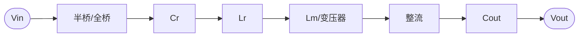
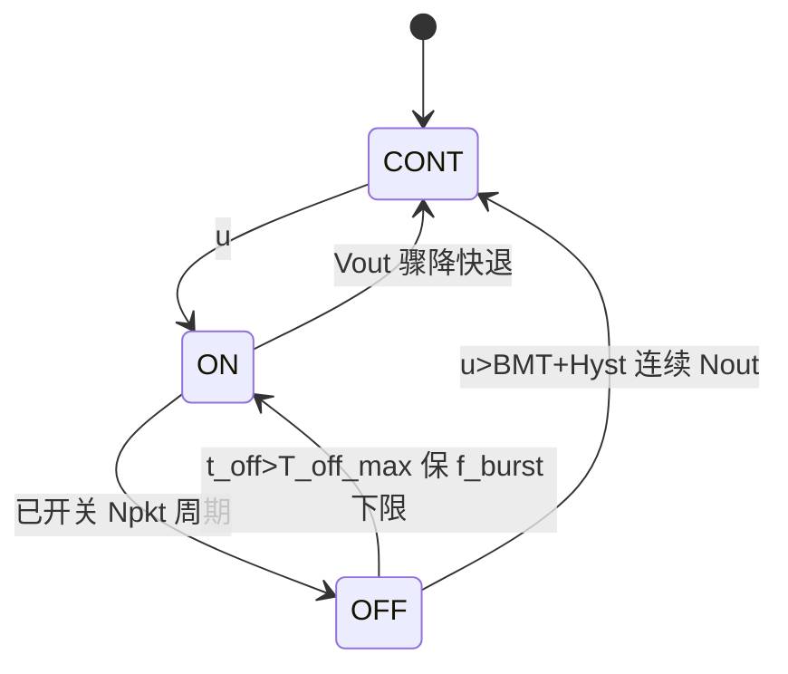
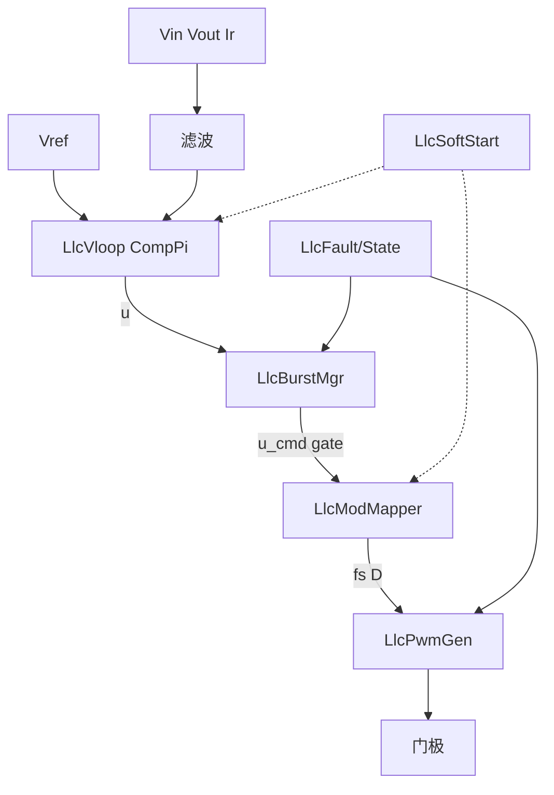
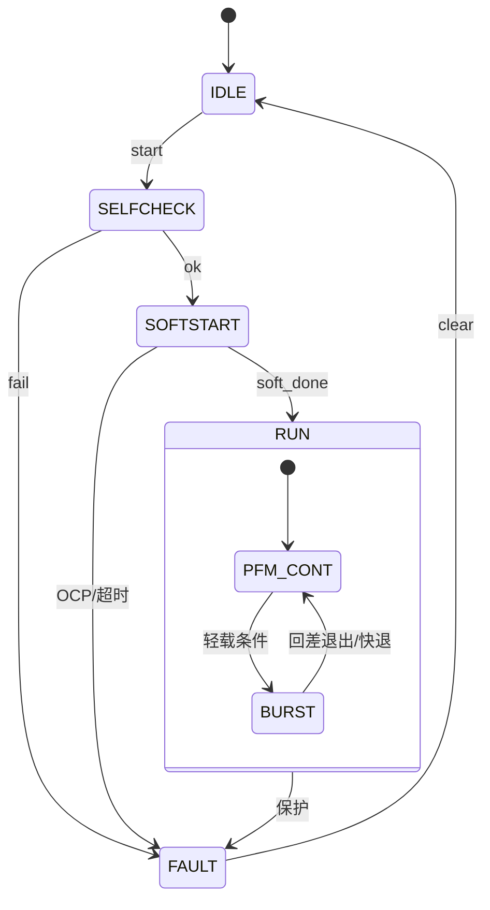

# LLC 谐振变换器：难点、策略与算法框架（FPGA）

> 面向本仓 `Algorithm_Framework_HDL` 的选型与实现依据。  
> 写法对齐 [`INV3PH_ALGO_COMPARE.md`](INV3PH_ALGO_COMPARE.md)：先讲清难点，再给可落地方案。  
> 拟 RTL 路径：`rtl/verilog/cntl/llc/` · 修订：2026-09-20  
> 姊妹文档：[DAB](DAB_CTRL_FRAMEWORK.md)

---

## 目录

1. [算法与拓扑原理](#1-算法与拓扑原理)
2. [增益区与 ZVS——核心难点](#2-增益区与-zvs核心难点)
3. [软启动浪涌——难点与方案](#3-软启动浪涌难点与方案)
4. [轻载效率与 Burst——难点与方案](#4-轻载效率与-burst难点与方案)
5. [宽输入/宽输出——混控方案](#5-宽输入宽输出混控方案)
6. [环路动态与补偿策略](#6-环路动态与补偿策略)
7. [保护与限流](#7-保护与限流)
8. [调制策略综合对比](#8-调制策略综合对比)
9. [FPGA 控制架构与模块划分](#9-fpga-控制架构与模块划分)
10. [实现复杂度与调试要点](#10-实现复杂度与调试要点)
11. [典型应用与选型建议](#11-典型应用与选型建议)
12. [附录：参数与接口草案](#12-附录参数与接口草案)

---

## 1. 算法与拓扑原理

### 1.1 功率级

半桥或全桥将直流斩成方波，经 \(C_r\)-\(L_r\)-\(L_m\) 谐振网络与变压器传能，副边整流后得到 \(V_{out}\)。



| 符号 | 定义 |
|------|------|
| \(f_r=1/(2\pi\sqrt{L_r C_r})\) | 串联谐振频率 |
| \(f_s\) | 开关频率（主控制量） |
| \(f_n=f_s/f_r\) | 归一化频率 |
| \(k=L_m/L_r\) | 电感比 |
| \(Q\) | 品质因数（随负载变化） |
| \(M\) | 电压增益（FHA 近似） |
| \(D\) | 桥臂占空比（软启/混控用） |

**FHA 增益（设计与离线 LUT，控制可不在线求根）：**

$$
M(f_n,Q,k)
= \frac{k}
{\sqrt{\bigl(1+k-\dfrac{k}{f_n^2}\bigr)^2
+ Q^2\bigl(f_n-\dfrac{1}{f_n}\bigr)^2}}
$$

### 1.2 控制在做什么

LLC 本质是：**在感性区内调节 \(f_s\)（及必要时的 \(D\)/移相/Burst），使 \(M(f_s)\) 满足 \(V_{out}\) 目标，同时尽量保持原边 ZVS、副边 ZCS/低损耗。**

一期定案（本库）：

| 工况 | 策略 |
|------|------|
| 稳态中重载 | 电压环 + **PFM** |
| 启动 | **PWM→PFM** 两段软启 |
| 轻载/待机 | **滞环 Burst** |
| 二期 | PFM+PSM、HHC、轨迹 Burst |

---

## 2. 增益区与 ZVS——核心难点

### 2.1 难点描述

| 难点 | 现象 | 根因 |
|------|------|------|
| **增益非单调 / 分区** | 同样调 \(f_s\)，不同负载方向可能相反 | FHA 曲线在容性/感性区形状不同 |
| **ZVS 丢失** | 硬开关、EMI、管温升 | 轻载励磁电流不足，无法在死区内抽干结电容 |
| **频率跑飞** | 轻载 \(f_s\to f_{max}\) 仍过压 | 增益下限不够，或环路把频率推到顶 |
| **FHA 误差** | 实测增益与公式偏差大 | 谐波、死区、整流导通角；重载/宽增益时尤甚 |

**工程分区（相对 \(f_r\)）：**

| 区域 | 条件（近似） | 特性 | 控制态度 |
|------|--------------|------|----------|
| 感性区（推荐） | \(f_s \ge f_r\) | 易 ZVS，增益随 \(f_s\uparrow\) 而↓ | **主工作区** |
| 容性区 | \(f_s < f_r\) 且负载轻 | 易失 ZVS、电流超前 | **禁止或严格限时** |
| 增益峰值附近 | 接近 \(f_r\) 偏下 | 增益高但易入容性 | 软启/限流时谨慎 |

### 2.2 解决方案

**方案 A — 频率窗硬约束（一期必做）**

$$
f_s^\* \in [f_{min},\,f_{max}],\quad
f_{min}\ge f_r \text{（或留安全裕度）}
$$

- \(f_{max}\)：器件/磁芯/EMI 上限；也是进入 Burst 的门槛之一。  
- 过流时 **只允许升频**（增益↓、电流↓），禁止往容性区降频。

**方案 B — 死区与励磁电流校核（设计期）**

死区 \(t_d\) 内需满足励磁电流能完成结电容充放电。轻载不满足时：

- 不要无限降功率靠继续升频；  
- 切 Burst，或短时 PWM/PSM 保 ZVS（见 §4、§5）。

**方案 C — 增益映射**

| 做法 | 优点 | 缺点 | 建议 |
|------|------|------|------|
| \(u\mapsto f_s\) 线性 | 实现极简 | 环路增益随工作点漂 | **一期** |
| FHA 反函数 LUT | 近似线性化对象 | 占 BRAM、Q/Vin 变时需多表 | 二期 |
| 在线辨识 | 自适应 | 复杂 | 一般不做 |

**本库结论：** 一期线性 PFM + 硬频率窗 + 过流只升频；ZVS 靠设计裕度与 Burst/混控补轻载。

---

## 3. 软启动浪涌——难点与方案

### 3.1 难点描述

上电瞬间 \(V_{out}\approx 0\)，等效负载极重。若：

- 直接闭环并给出接近 \(f_r\) 的低频 → **增益极大** → \(i_r\) 浪涌；或  
- 仅开环很快降频 → 同样浪涌。

后果：谐振电容过压、变压器饱和、原边过流保护误动作、甚至损坏开关管。

### 3.2 方案对比

| 方案 | 做法 | 浪涌 | 建压时间 | 实现难度 | 推荐 |
|------|------|------|----------|----------|------|
| 纯降频软启 | \(f_s: f_{max}\to f_{op}\) | 较大 | 短 | 低 | Fallback |
| **PWM→PFM 两段** | 先定高 \(f_{ss}\) 调 \(D\)，再降频 | **可降约 40%+** | 适中 | 中 | **一期主方案** |
| 闭环限 \(dV/dt\) | 按电压上升率调 \(D\)/\(f_s\) | 小 | 可控 | 中高 | 增强 |
| 电荷/电流轨迹 | 按状态平面规划 | 最优 | 短 | 高 | 二期 |

### 3.3 推荐方案细节（PWM→PFM）


| 阶段 | \(f_s\) | \(D\) | 电压环 | 退出条件 |
|------|---------|-------|--------|----------|
| **SS_PWM** | 固定 \(f_{ss}\in[1.5,2.0]f_r\) | \(0\to 0.5\) 斜坡 | 可旁路或弱跟 | \(V_{out}\ge V_{handoff}\) |
| **SS_PFM** | \(f_{ss}\) **下降**至工作点 | 锁 0.5 | 解冻，\(V_{ref}\) 斜坡 | \(\|V_{out}-V_{ref}\|\) 小且 \(I_r\) OK |
| **SS_DONE** | 闭环 PFM | 0.5 | 正常 | — |

**交接注意：**

- 禁止在交接瞬间突变 \(f_s\) 或 \(D\)（用斜坡/重叠）。  
- SoftStart 未完成：**禁止 Burst**。  
- 全程 OCP：触发则冻结斜坡或回到更高 \(f_s\)/更小 \(D\)。

**RTL：** `LlcSoftStart` 编排 + `CompSoftStart` 做斜坡；状态机禁止 Burst。

---

## 4. 轻载效率与 Burst——难点与方案

### 4.1 难点描述

| 难点 | 说明 |
|------|------|
| 轻载升频 | PFM 把 \(f_s\) 推到 \(f_{max}\) 仍可能过压或效率极差 |
| 磁损/驱动损耗 | 高频下空载损耗主导 |
| Burst 纹波 | 间歇开关 → \(V_{out}\) 低频纹波、可听噪声 |
| Burst 进出抖振 | 门限无回差 → 反复进出 |
| 包内效率 | 随机开关相位效率低于最优轨迹 |

### 4.2 方案对比

| 方案 | 思路 | 纹波 | 啸叫 | 效率 | 一期 |
|------|------|------|------|------|------|
| 继续死顶 \(f_{max}\) | 不 Burst | 小 | 无 | 差 | 否 |
| **滞环 Burst + 定 Npkt** | COMP&lt;BMT 后打固定包再停 | 中 | 需 \(f_{burst}\) 下限 | 好 | **是** |
| 变占空比 PFM | 降有效 \(D\) 代替 Burst | 较小 | 低 | 较好 | 二期备选 |
| 三脉冲轨迹 Burst | 状态平面最优包 | 可控 | 可能过低 | **最好** | 二期 |
| 双脉冲 / 定 \(f_{burst}\) | 抬高重复频率 | 较小 | **优** | 略降 | 二期极轻载 |

### 4.3 推荐 Burst 状态机



| 参数 | 含义 | 建议 |
|------|------|------|
| \(u\) | 电压环输出（控制努力） | 映射到 \(f_s\) 前的量 |
| BMT | 进入门限 | 可随 \(V_{in}\) 自适应 |
| Hyst | 退出回差 | 必加，防抖 |
| Npkt | 包内周期数 | 固定，功率包一致 |
| \(f_{burst,min}\) | 重复频率下限 | \(\ge 20\sim25\,\mathrm{kHz}\) |

**包内功率概念：**

$$
P_{avg}\approx P_{pkt}\cdot\frac{T_{on}}{T_{burst}}
$$

**包内 \(f_s\)：** 取靠近高效点（常近 \(f_r\) 感性侧）或当前 \(f_{min}\)，不要用 \(f_{max}\)。

**工业参考行为（概念对齐，非移植代码）：** UCC2563x 类「COMP 与 BMT 取大 + 定包」；TEA2017 类「定 Burst 频率调包长」。

---

## 5. 宽输入/宽输出——混控方案

### 5.1 难点描述

OBC、宽电池电压等场景要求增益范围远超窄带 PFM 能舒适覆盖的区间：

- 仅 PFM → \(f_s\) 跨度过大，磁设计与 EMI 恶化；  
- 模式切换（PFM↔PWM/PSM）若无重叠区 → **输出电流/电压浪涌**。

### 5.2 解决方案

| 策略 | 适用 | 做法 | 切换要点 |
|------|------|------|----------|
| PFM only | 窄增益 | 一期默认 | — |
| PFM + PWM 下限 | 需更低增益 | \(f_s=f_{min}\) 后改调 \(D\) | \(D\) 从 0.5 连续减小 |
| PFM + PSM | 全桥宽输出 | 高频侧移相降增益 | **重叠区**：双指令短时并存再交叉淡出 |
| FB/HB 重构 | 超宽输入 | 拓扑改半桥等效减半增益 | 硬件+状态机协同 |

**本库一期：** 不做混控；预留 `LlcModMapper` 的 \(D^\*\) 接口。二期若上 PSM，必须做重叠切换与浪涌 TB。

---

## 6. 环路动态与补偿策略

### 6.1 难点描述

经典 PFM 下，控制到输出常呈 **二阶甚至更复杂** 对象，增益随 \(V_{in}/Q/f_s\) 剧烈变化 → 一组 PI 难全工作点稳定，暂态易振铃。

### 6.2 方案对比

| 策略 | 对象阶次（近似） | 传感需求 | 暂态 | 一期 |
|------|------------------|----------|------|------|
| **电压环 PI + PFM** | 偏二阶 | \(V_{out}\) | 一般 | **是** |
| 电流均值/峰值叠加 | 改善限流 | \(I_r\) | 较好 | 限流支路必做 |
| **HHC（混合滞环/电荷）** | 近一阶 | 谐振电流或重建 | **优** | 二期 |
| 多增益调度 PI | 分段 | 工作点检测 | 较好 | 可选 |

**一期实现：**

$$
e_v=V_{ref}-V_{out},\quad
u=\mathrm{PI}(e_v),\quad
f_s^\*=f_{max}-u(f_{max}-f_{min})
$$

加：输出限幅、积分抗饱和（`CompPi` 已有）、\(I_r\) 限流抬频。

---

## 7. 保护与限流

| 保护 | 检测 | 动作优先级 |
|------|------|------------|
| OCP | \(i_{r,peak}\) / 原边电流 | ① 瞬时抬频 ② 关断→故障→重软启 |
| OVP | \(V_{out}\)、半桥中点（可选） | 抬频 / 关断 |
| UVLO | \(V_{in}\) | 关断 |
| 短路 | 持续过流 | 锁存 FAULT |
| 过温 | 外部 | 降额（升 \(f_{min}\)）或关断 |

**原则：** 限流与保护 **优先于** 电压环；限流方向与增益方向一致（升频降增益）。

---

## 8. 调制策略综合对比

| 维度 | PFM | PWM/APWM | PSM | Burst | HHC |
|------|-----|----------|-----|-------|-----|
| 中重载效率 | ★★★★★ | ★★★ | ★★★★ | — | ★★★★★ |
| 轻载效率 | ★★ | ★★ | ★★★ | ★★★★★ | ★★★★ |
| ZVS 易保性 | ★★★★ | ★★ 轻载差 | ★★★★ | ★★★★（包内） | ★★★★ |
| 宽增益 | ★★★ | ★★★★ | ★★★★★ | 否 | ★★★ |
| 输出纹波 | ★★★★★ | ★★★★ | ★★★★ | ★★ | ★★★★★ |
| FPGA 实现 | 易 | 易 | 中 | 中 | 难 |
| **本库一期** | **主** | 软启 | 二期 | **轻载** | 二期 |

---

## 9. FPGA 控制架构与模块划分

### 9.1 信号流



### 9.2 系统状态机



### 9.3 模块表（拟 `cntl/llc/`）

| 模块 | 解决的难点 | 复用 |
|------|------------|------|
| `llc_cfg.vh` | 频率窗、BMT、阈值 | — |
| `LlcFault` | §7 | 对齐 inv3ph/pv |
| `LlcState` | 全局安全顺序 | — |
| `LlcSoftStart` | §3 | `CompSoftStart` |
| `LlcVloop` | §6 | `CompPi` |
| `LlcBurstMgr` | §4 | — |
| `LlcModMapper` | §2 映射+限流 | — |
| `LlcPwmGen` | 变频时基/死区/门控 | — |

---

## 10. 实现复杂度与调试要点

| 阶段 | 工作 | 风险 | 调试建议 |
|------|------|------|----------|
| 开环 PWM | 定频定占空 | 直通 | 先查死区与极性 |
| 开环扫频 | 看增益方向 | 入容性 | 确认 \(f_{min}\) |
| 软启 | 看 \(i_r\) 峰值 | 浪涌 | 对比纯降频 |
| 闭环空载 | 易进 Burst | 啸叫/纹波 | 先关 Burst 调 PI |
| 闭环加载 | 带宽/相位裕度 | 振荡 | 多工作点扫 |
| 开 Burst | 进出抖、噪声 | 回差/ \(f_{burst}\) | 示波器听音频 |

**FPGA 资源直觉：** 以 PI + 数控振荡器 + 简单 Burst 为主，DSP 占用远低于三相多环逆变；主要成本在 ADC 同步与保护路径延迟。

---

## 11. 典型应用与选型建议

### 决策树

```
增益范围是否很宽（如宽电池电压）？
├── 是 → 二期 PFM+PSM/PWM，一期仍可先 PFM+Burst 验证环路
└── 否
     ├── 是否长期极轻载/待机？
     │    ├── 是 → 必须 Burst（定 Npkt + f_burst 下限）
     │    └── 否 → PFM + 软启即可
     └── 暂态要求极高？
          ├── 是 → 评估 HHC
          └── 否 → 电压 PI + PFM（本库一期）
```

| 场景 | 推荐 |
|------|------|
| 服务器/适配器 LLC（窄增益） | PFM + PWM→PFM 软启 + Burst |
| 车载 OBC 后级（宽电池） | PFM+PSM + 重叠切换 + 软启 |
| 超低待机功耗 | Burst + 自适应 BMT |

---

## 12. 附录：参数与接口草案

### A. 典型量级（需按磁件/功率缩放）

| 参数 | 量级 | 说明 |
|------|------|------|
| \(f_r\) | 80～150 kHz | 设计中心 |
| \(f_{min}\) | \(\ge f_r\) | 感性区 |
| \(f_{max}\) | 1.5～2.5 \(f_r\) | EMI/磁损 |
| \(f_{ss}\) | 1.5～2 \(f_r\) | 软启定频 |
| 电压环带宽 | 远低于 \(f_s\) | 数百 Hz～数 kHz 视功率 |
| Npkt | 数个～数十周期 | 纹波与效率折中 |
| \(f_{burst,min}\) | ≥20～25 kHz | 啸叫 |

### B. 与本库映射

`CompPi` / `CompSoftStart` / `CompLpf1` / `CompRateLimit` → 控制核；新建 Burst、变频 PWM、FSM。

### C. 验证清单

1. 开环变频方向正确  
2. 软启 \(i_r\) 峰值对比  
3. 负载阶跃无静差、无持续振荡  
4. Burst 进出无抖、突加负载立即退出  
5. OCP 锁存与恢复  

---

*本文档供 FPGA 算法库实现选型；数值须按具体磁件与功率等级标定。*
